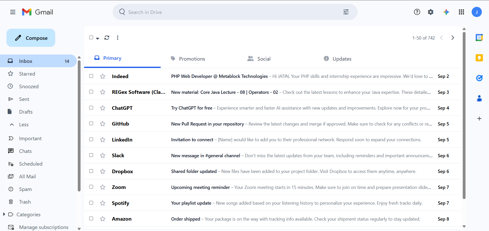

<div align="center">
  
  <h1>Google Mail UI Clone</h1>
  <h4>A responsive Google Mail (Gmail) interface clone built with 
      <a href="https://tailwindcss.com" target="_blank">Tailwind CSS</a>, 
      <a href="https://fontawesome.com" target="_blank">Font Awesome</a>, 
      and HTML.</h4>

  <p>
    <a href="https://jatinsoni08.github.io/GoogleMailClone/">View Live Demo</a> ·
    <a href="https://github.com/jatinsoni08/GoogleMailClone/issues">Report Bug</a> ·
    <a href="https://github.com/jatinsoni08/GoogleMailClone/issues">Request Feature</a>
  </p>

  <p>
    
    
    
    
  </p>

  <p>
    <a href="#key-features">Key Features</a> •
    <a href="#tech-stack">Tech Stack</a> •
    <a href="#responsive-design">Responsive Design</a> •
    <a href="#installation">Installation</a> •
    <a href="#usage">Usage</a> •
    <a href="#preview">Preview</a> •
    <a href="#license">License</a>
  </p>

  <div style="display: flex; justify-content: center; gap: 20px; flex-wrap: wrap;">
    
  </div>
</div>

---

## ✨ Key Features

- **📱 Responsive Layout** – Works on desktop, tablet, and mobile.  
- **📥 Sidebar Navigation** – Inbox, Starred, Drafts, Sent, Spam, Trash, and More.  
- **🔍 Search Bar** – Modern search input with filter icon.  
- **📑 Categories Tabs** – Primary, Social, Promotions, Updates.  
- **📩 Email List** – Sample styled email items with sender, subject, and time.  
- **⚡ Interactive Sidebar** – Expand/collapse with localStorage support.  
- **🎨 Clean UI** – Inspired by Gmail’s minimal and functional design.  

---

## 🛠️ Tech Stack

| Technology | Purpose |
|------------|---------|
|  **HTML5** | Semantic markup structure |
|  **Tailwind CSS** | Utility-first CSS framework |
|  **Font Awesome** | Icons library |
|  **Vanilla JavaScript** | Sidebar toggle & interactions |

---

## 📱 Responsive Design

This Gmail clone adapts to all screen sizes:

| Device | Layout Features |
|--------|----------------|
| **📱 Mobile** (< 768px) | Bottom navigation bar, floating compose button |
| **📟 Tablet** (768px - 1024px) | Sidebar toggle available, wider layout |
| **💻 Desktop** (> 1024px) | Full sidebar, categories, and right panel |

---

## 🚀 Installation

No build tools required! Run it directly:

```bash
# Clone the repo
git clone https://github.com/jatinsoni08/GoogleMailClone.git

# Open folder
cd GoogleMailClone

# Run in browser
open index.html
